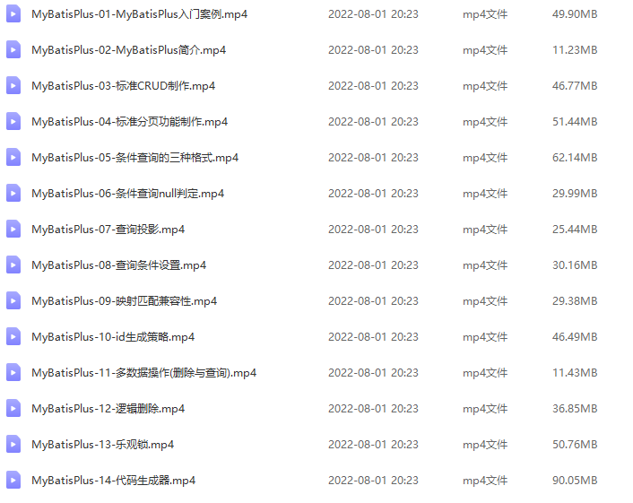

演示MyBatisPlus增删查改数据库!



## 使用Mybatisplus对数据库进行增删查改

- 开启mp的日志(输出到控制台)

- Mybatisplus查询语法

- 分页拦截器(解决查看具体的查询条数问题)

- 范围查询(继承方式解决)

- mybatisplus代码生成器

- 表与实体映射关系(pom配置演示在03)

```java
@Data
//设置表名映射关系
//@TableName("tbl_user")，可以不写，因为配置了全局前置
public class User {
    //设置主键生成策略
    // @TableId(type = IdType.ASSIGN_ID)
    private Long id;
    private String name;
    @TableField(value = "pwd", select = false)
    private String password;
    private Integer age;
    private String tel;
    @TableField(exist = false)
    private Integer online;
    //逻辑删除字段，标记当前记录是否被删除
    // @TableLogic(value = "0" ,delval = "1")
    private Integer deleted;
    @Version
    private Integer version;
}
```

- 继承与自定义dao方法

```java
package com.itheima.dao;

import com.baomidou.mybatisplus.core.mapper.BaseMapper;
import com.itheima.domain.User;
import org.apache.ibatis.annotations.Insert;
import org.apache.ibatis.annotations.Mapper;

@Mapper
public interface UserDao extends BaseMapper<User> {
    // 自定义一个保存.
    @Insert("insert into tbl_user(name,pwd,age,tel)values(#{Name},#{Passwd},#{Age},#{Tel})")
    void DefineSave(String Name, String Passwd, int Age, String Tel);
}
```