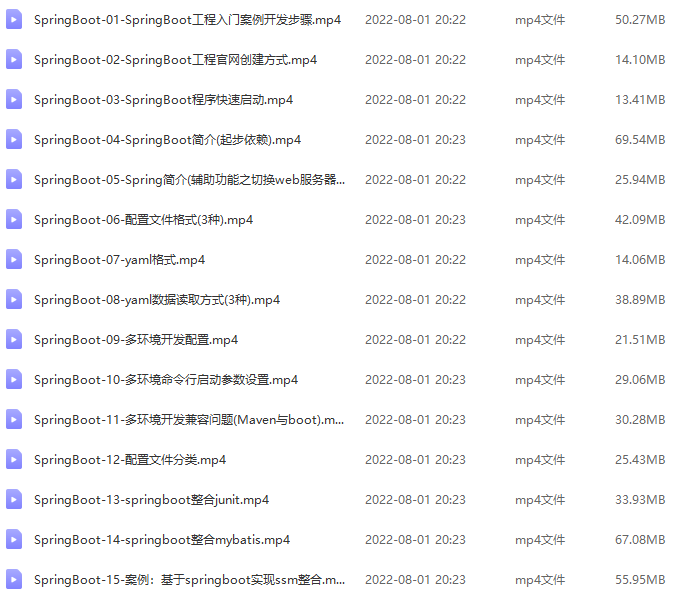

# Spring Boot学习笔记

## 知识点

- properties,yml,yaml优先级

- 从yaml中读取数据的三种方式

- 多环境开发配置

- 多环境命令行启动参数

- SpringBoot整合

- 图书馆整合-SpringBoot版

- AOP异常捕获

## 实现功能

- 完成一个图书馆系统页面RestFul增删查改基本功能，以及AOP通知类实现业务代码出错处理，以及事务管理，同成功，同失败。

- 核心注解 `@RestControllerAdvice`。