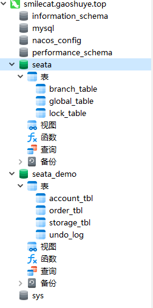
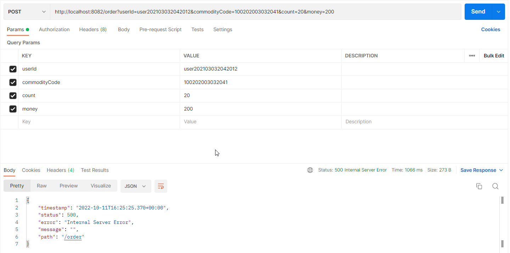

# Seata与Nacos的集成(集群方式)-分布式事务策略：AT

<font siez=6 color=red>单机seata+AT模式, 无关文件已经清理掉.</font>


可以参看如下操作：https://seata.io/zh-cn/blog/seata-nacos-docker.html

## 步骤如下：

- 数据库配置：seata+nacos

注意：最好进入到本路径下再操作！

```sql
# 创建数据库
mysql -h 127.0.0.1 -u root -pabc123456

source seata.sql

source nacos.sql

```

- 数据库配置：seata-demo

演示数据库事务中，数据库中的数据时候修改！

```sql
# 执行sql：创建数据库+导入数据
source seata-demo.sql
```

### nacos的配置

路径：/usr/local/etc/standalonenacos/application.properties

```bash
server.servlet.contextPath=/nacos
server.port=8848
spring.datasource.platform=mysql
db.num=1
db.url.0=jdbc:mysql://mysql:3306/nacos_config?characterEncoding=utf8&connectTimeout=1000&socketTimeout=3000&autoReconnect=true&useUnicode=true&useSSL=false&serverTimezone=UTC
db.user.0=root
db.password.0=root
db.pool.config.connectionTimeout=30000
db.pool.config.validationTimeout=10000
db.pool.config.maximumPoolSize=20
db.pool.config.minimumIdle=2
nacos.naming.empty-service.auto-clean=true
nacos.naming.empty-service.clean.initial-delay-ms=50000
nacos.naming.empty-service.clean.period-time-ms=30000
management.metrics.export.elastic.enabled=false
management.metrics.export.influx.enabled=false
server.tomcat.accesslog.enabled=true
server.tomcat.accesslog.pattern=%h %l %u %t "%r" %s %b %D %{User-Agent}i %{Request-Source}i
server.tomcat.basedir=
nacos.security.ignore.urls=/,/error,/**/*.css,/**/*.js,/**/*.html,/**/*.map,/**/*.svg,/**/*.png,/**/*.ico,/console-ui/public/**,/v1/auth/**,/v1/console/health/**,/actuator/**,/v1/console/server/**
nacos.core.auth.system.type=nacos
nacos.core.auth.enabled=false
nacos.core.auth.default.token.expire.seconds=18000
nacos.core.auth.default.token.secret.key=SecretKey012345678901234567890123456789012345678901234567890123456789
nacos.core.auth.caching.enabled=true
nacos.core.auth.enable.userAgentAuthWhite=true
nacos.core.auth.server.identity.key=
nacos.core.auth.server.identity.value=
```

## seata的配置

注意不要写错细节，尤其是配置问题。

路径：/usr/local/etc/seataContain/registry.conf

```bash
registry {
  # file 、nacos 、eureka、redis、zk、consul、etcd3、sofa
  type = "nacos"

  nacos {
    application = "seata"
    serverAddr = "91.199.209.120:8848"
    # 这个是seate的组
    group = "DEFAULT_GROUP"
    namespace = ""
    # cluster = "default"
    # 与client.properties事务组映射关系
    # service.vgroupMapping.seata-demo=SH
    cluster = "SH"
    username = "nacos"
    password = "nacos"
  }
}

config {
  # file、nacos 、apollo、zk、consul、etcd3
  type = "nacos"

  nacos {
    serverAddr = "91.199.209.120:8848"
    namespace = ""
    # 这个是nacos的组
    group = "SEATA_GROUP"
    username = "nacos"
    password = "nacos"
    dataId = "seataServer.properties"
  }
}
```

- 启动容器

注意：必须保证容器名称不能相同，容器内部通过容器名称互相访问，实现单机节点的部署问题。由于挂载了配置到容器，所以容器删除不会影响结果，nacos启动非常慢，约10s，其他2s即可启动，所以需要重启其他的容器！

```bash
docker-compose up -d
docker-compose restart seata storage-service order-service
```

## nacos配置给seata读取

seata启动后会从nacos中读取详细的配置,所有的seata都会读取该配置nacos上的配置文件.


nacos配置文件名称: `seataServer.properties`

GrouP：DEFAULT_GROUP


```bash
store.mode=db
store.db.datasource=druid
store.db.dbType=mysql
store.db.driverClassName=com.mysql.cj.jdbc.Driver
store.db.url=jdbc:mysql://mysql:3306/seata?characterEncoding=utf8&autoReconnect=true&useUnicode=true&useSSL=false&allowPublicKeyRetrieval=true&serverTimezone=Asia/Shanghai&rewriteBatchedStatements=true
store.db.user=root
store.db.password=abc123456
store.db.minConn=5
store.db.maxConn=30
store.db.globalTable=global_table
store.db.branchTable=branch_table
store.db.queryLimit=100
store.db.lockTable=lock_table
store.db.maxWait=5000
# 事务、日志等配置
server.recovery.committingRetryPeriod=1000
server.recovery.asynCommittingRetryPeriod=1000
server.recovery.rollbackingRetryPeriod=1000
server.recovery.timeoutRetryPeriod=1000
server.maxCommitRetryTimeout=-1
server.maxRollbackRetryTimeout=-1
server.rollbackRetryTimeoutUnlockEnable=false
server.undo.logSaveDays=7
server.undo.logDeletePeriod=86400000

# 客户端与服务端传输方式
transport.serialization=seata
transport.compressor=none
# 关闭metrics功能，提高性能
metrics.enabled=false
metrics.registryType=compact
metrics.exporterList=prometheus
metrics.exporterPrometheusPort=9898
````


## AT模式的表结构




## 测试路径



```html
http://localhost:8082/order?userId=user202103032042012&commodityCode=100202003032041&count=20&money=200
```

## 复现AT效果特别注意事项

- 注意核对服务器时间.

- 只能单seata,不能开两个.

- 已经清除tcc的相关代码.

- 注册到nacos较慢，可能需要docker-compose up -d或者docker-compose restart seata

- 启动创建订单+扣除余额+扣除库存服务较慢,等10s.

- 已经升级高版本的mysql.