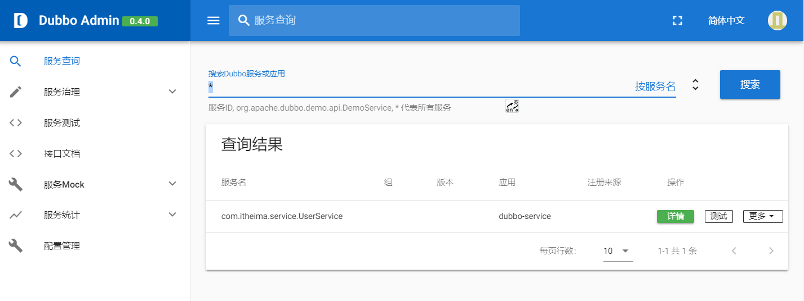
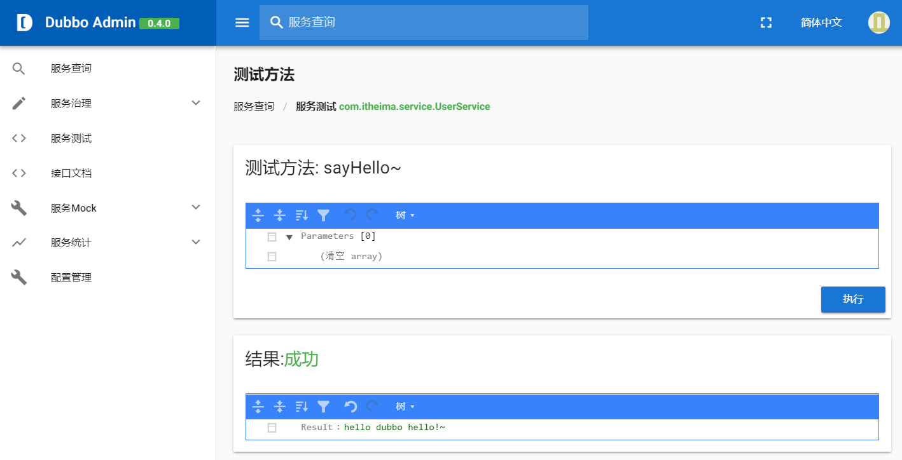

# Dubbo

## tip

- 未使用mavenpom打包管理，所以需要单独对每个子项目compile...

- node-v12.14.0-x64.msi，注意版本匹配性问题，不保证请使用docker比较合适。

- 知识点位置:`第3阶段企业级开发—微服务框架`.

- 资料在Dubbo和ZooKeeper中.


## ZooKeeper启动

- 单个启动

```bash
docker run --name zk -p 2181:2181 zookeeper:3.8.0-temurin
```

- 多个集群启动

```bash
docker-compose up -d

# 默认配置文件路径/conf/zoo.cfg

# 内容为:
"""
dataDir=/data
dataLogDir=/datalog
tickTime=2000
initLimit=5
syncLimit=2
autopurge.snapRetainCount=3
autopurge.purgeInterval=0
maxClientCnxns=60
standaloneEnabled=true
admin.enableServer=true
server.1=zk1:2888:3888;2181
server.2=zk2:2888:3888;2181
server.3=zk3:2888:3888;2181
"""
```

- 面板 `dubbo-admin`

```bash
# 默认账户密码为root.
docker pull apache/dubbo-admin:0.4.0

# docker-compose.yml带其他扩展名的为其他用途配置文件.

# 默认端口8080，路径localhost:8080
```

## 远程调用

- 测试远程服务:dubbo-service。





- 将远程的服务在本地调用，类似于本地方法，不过注解由@Autowired成为远程注入。

```java
// 远程注入
@Reference
private UserService userService;
```

## 其他高级功能

- 地址缓存

- 对象必须序列化等


